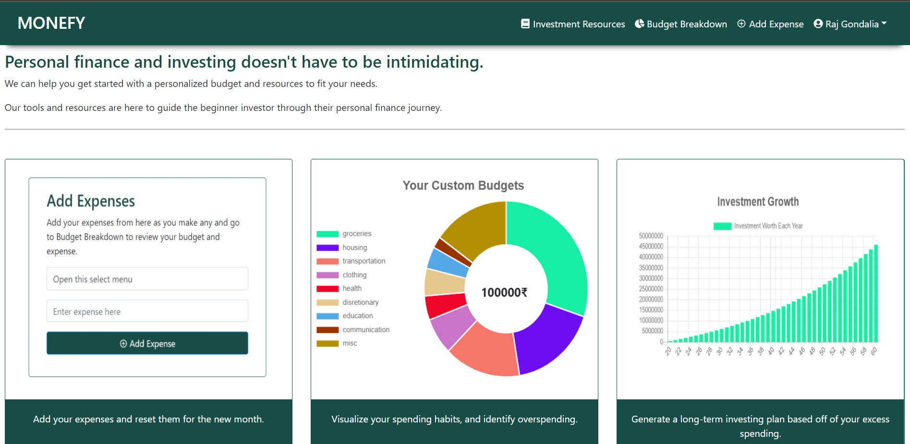
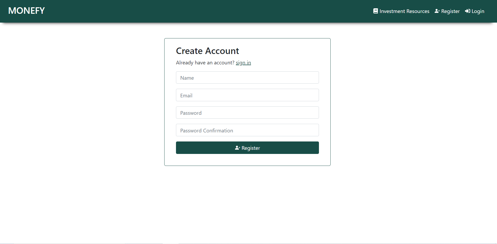
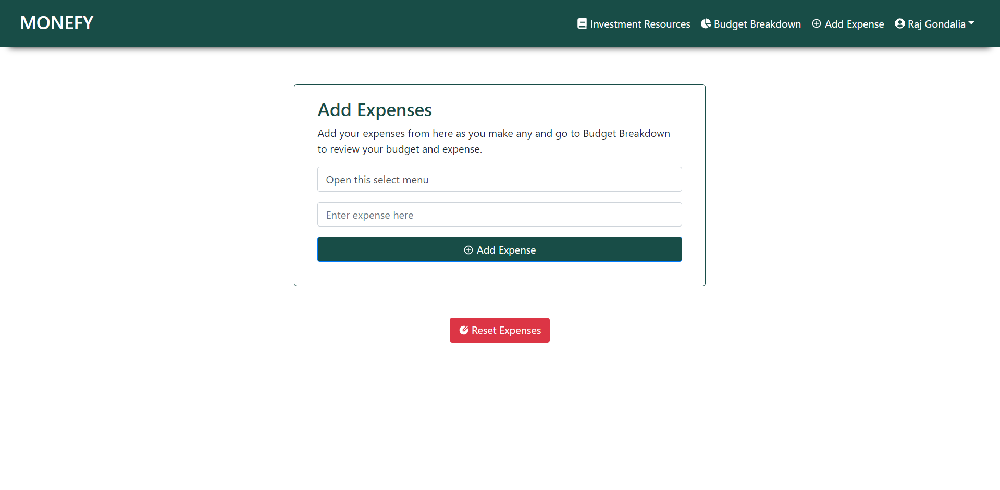
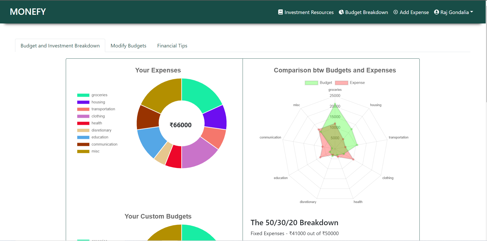
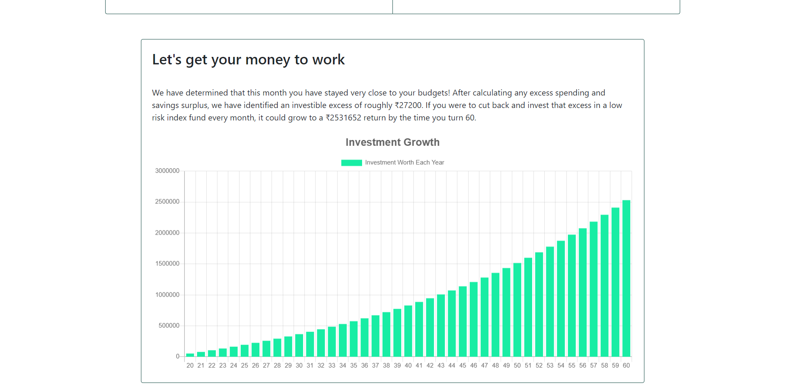
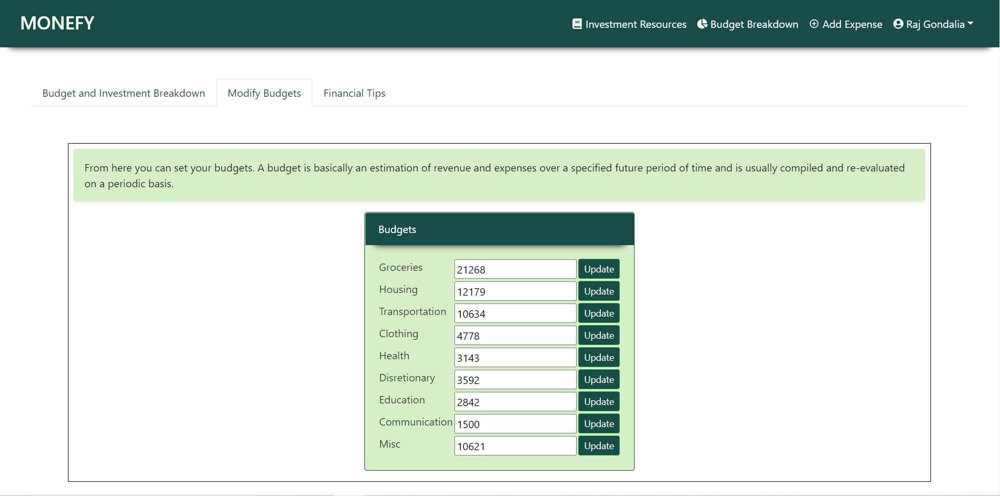
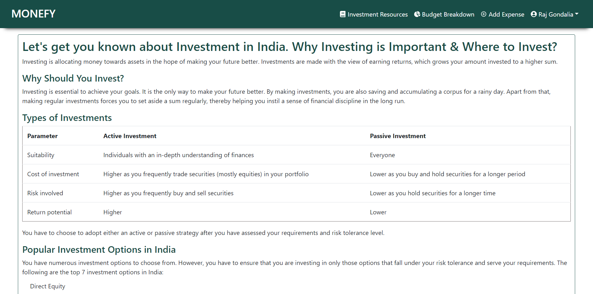

# Monefy - Backend

Monefy is a React.js / Node.js personal finance application, developed to help users budget properly and consider investing.

[This](https://github.com/raj-gondalia/monefy-frontend) is a link to the front-end repository.

[This](https://monefy-webapp.herokuapp.com/) is a link to the website.

## Screenshots
Home Page



Create Account



Add Expenses



Track Your Spending



Realize Potential Investment



Customize Budgets



Learn More On Investing




## Technology Used

- JavaScript
- Node
- React
- Bootstrap

## Features

Users Can:
- Create an account
- Add Expenses
- Track their spending and budgeting
- Customize their budgets
- Work towards an investment goal
- Edit their income, age, or delete their account

## Installation

Clone the front-end, and run 
```
$ npm install
$ npm start
```

## Contributing

Contributions are welcome, submit a pull request!

## Authors

* **Raj Gondalia** - [GitHub](https://github.com/raj-gondalia) | [LinkedIn](https://www.linkedin.com/in/raj-gondalia-0a07a016a/)

* **Jaimis Miyani** - [GitHub](https://github.com/JaimisMiyani) | [LinkedIn](https://www.linkedin.com/in/miyani-jaimis-24024817b/)
